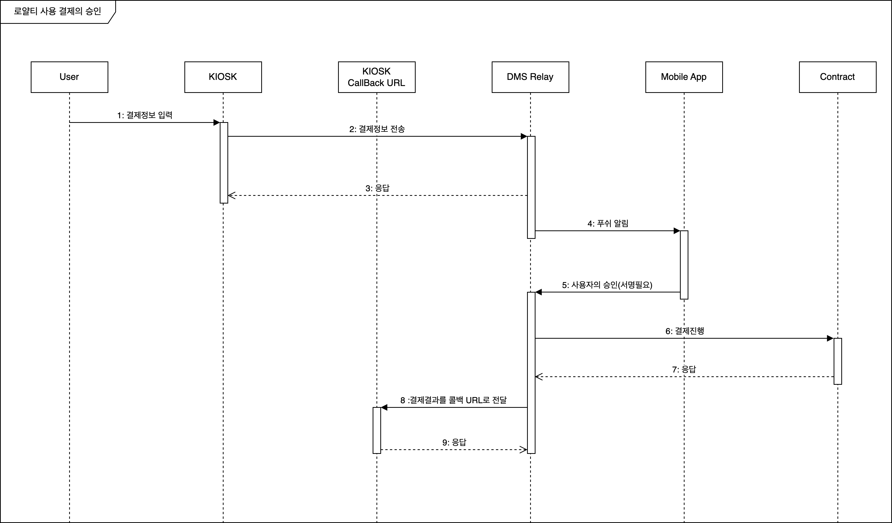
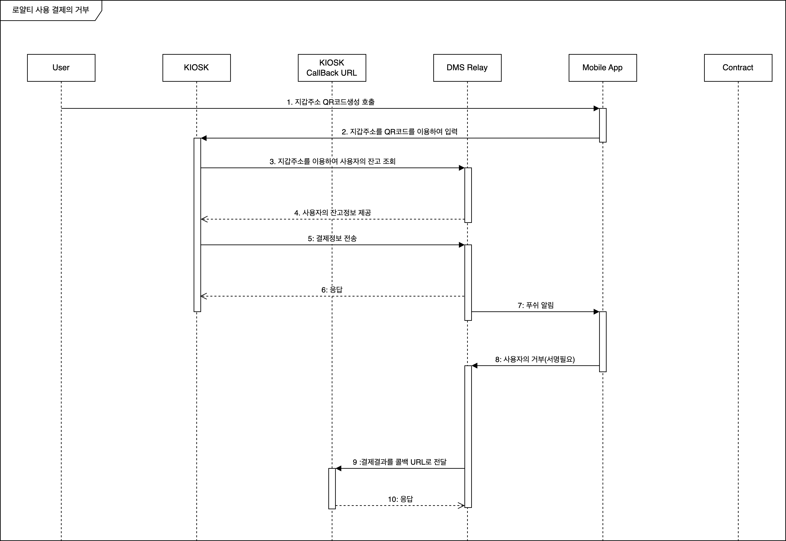

# 로열티를 사용한 결제 프로세스 - 시퀀스 다이어그램

## A. 결제에 대한 사용자가 승인 했을 때 과정

1. 사용자가 KIOSK 화면에 결제 정보를 입력한다. (모바일앱의 QR코드를 통해 지갑주소를 전달한다.)
2. KIOSK에서 DMS Relay 서버로 결제 정보를 전송한다.
3.
4. 지갑이 내장된 모바일앱에 푸쉬메세지를 전송한다.
5. 사용자는 푸쉬메세지를 받고 해당 결제에 승인한다.
6. 결제를 진행하기 위해 컨트랙트를 호출한다.
7. 컨트랙트의 실행후 이벤트를 수집한다.
8. 최종 결제 결과를 KIOSK로 전달한다.

## B. 결제에 대한 사용자가 거부 했을 때 과정

1. 사용자가 KIOSK 화면에 결제 정보를 입력한다. (모바일앱의 QR코드를 통해 지갑주소를 전달한다.)
2. KIOSK에서 DMS Relay 서버로 결제 정보를 전송한다.
3.
4. 지갑이 내장된 모바일앱에 푸쉬메세지를 전송한다.
5. 사용자는 푸쉬메세지를 받고 해당 결제에 거부한다.
6. 최종 거부된 결과를 KIOSK로 전달한다.
