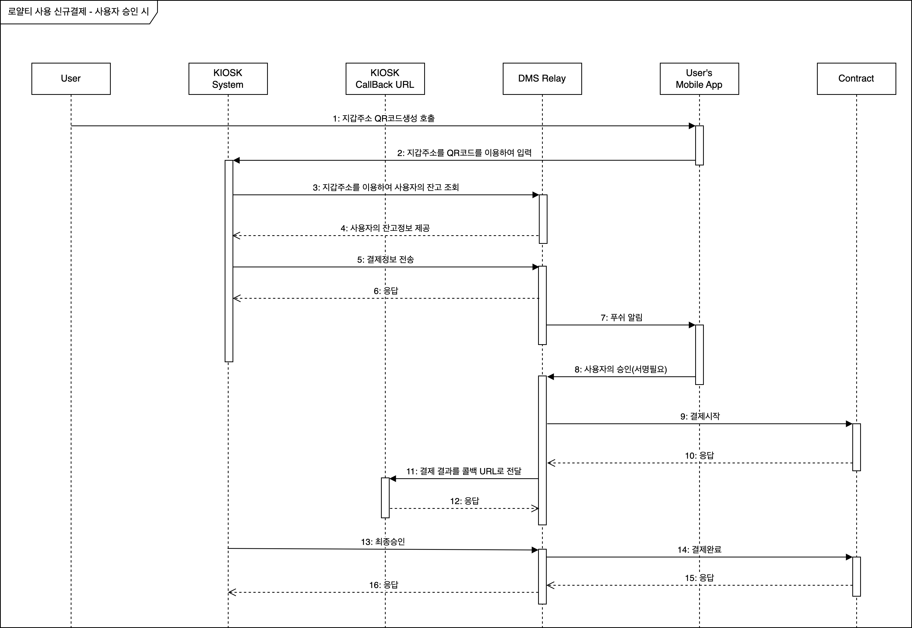
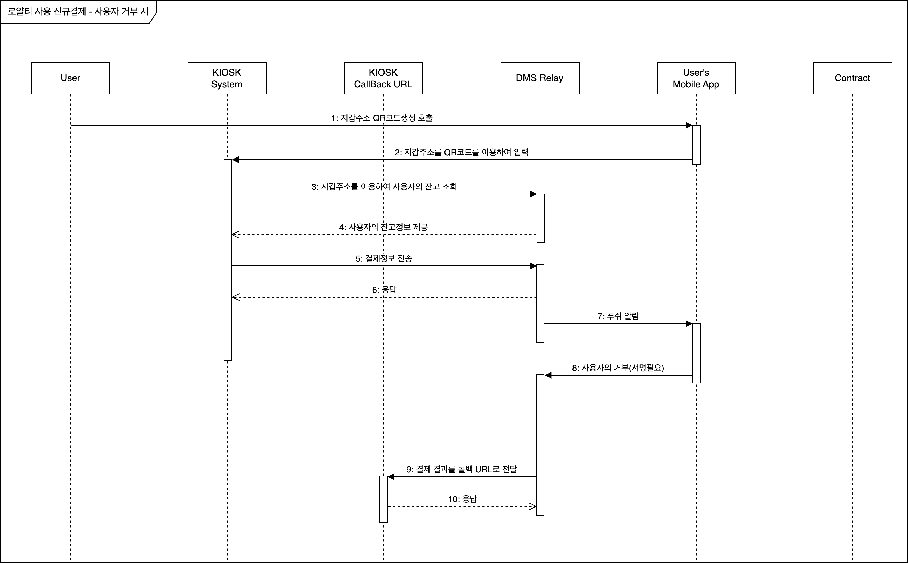
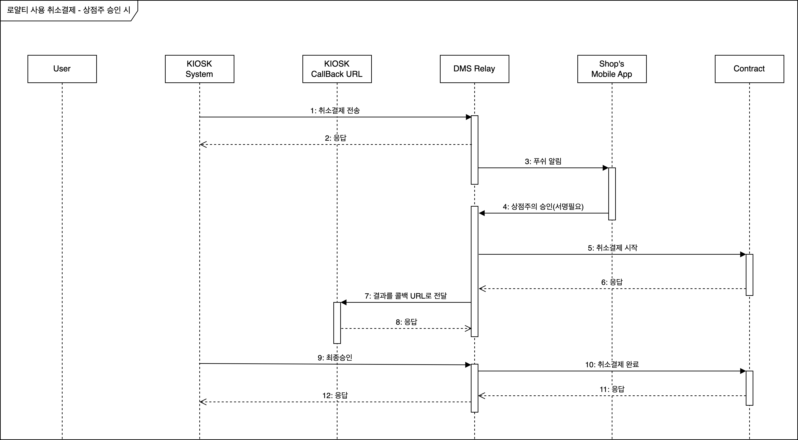
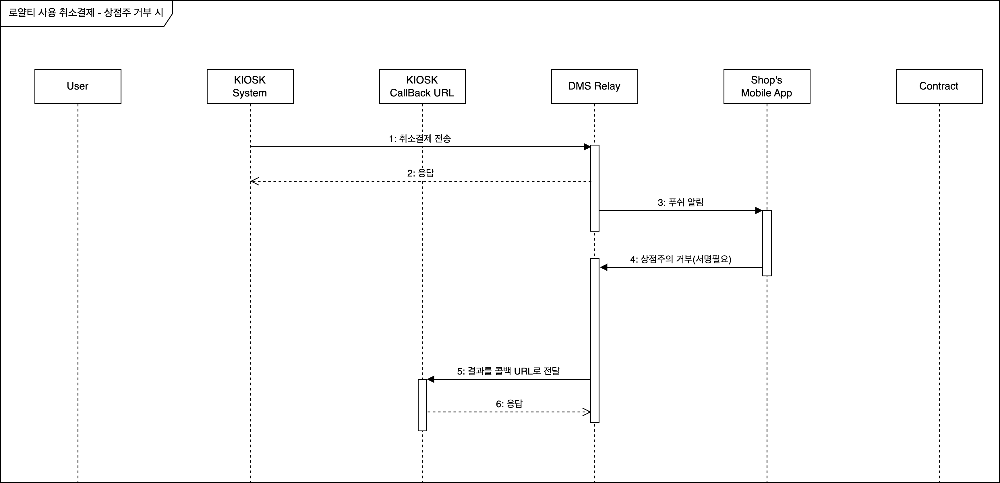
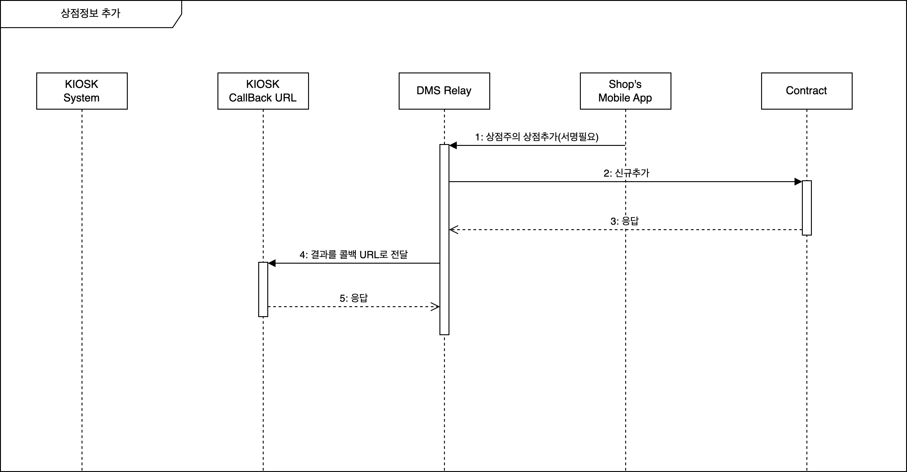
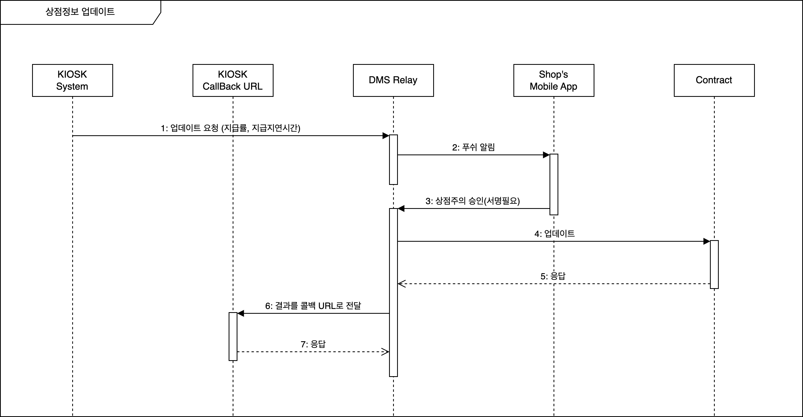
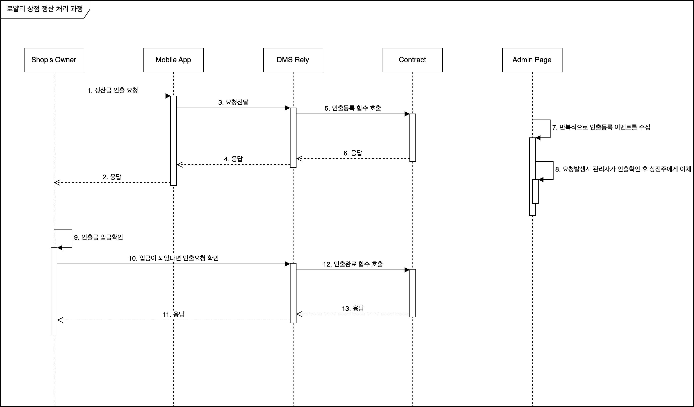

# 로열티를 사용한 결제 프로세스

-   [1. 시퀀스 다이어그램](#1-시퀀스-다이어그램)

    -   [1.1. 신규결제에 대한 사용자가 승인 했을 때 과정](#11-신규결제에-대한-사용자가-승인-했을-때-과정)
    -   [1.2. 신규결제에 대한 사용자가 거부 했을 때 과정](#12-신규결제에-대한-사용자가-거부-했을-때-과정)
    -   [1.3. 취소결제에 대한 상점주가 승인 했을 때 과정](#13-취소결제에-대한-상점주가-승인-했을-때-과정)
    -   [1.4. 취소결제에 대한 상점주가 거부 했을 때 과정](#14-취소결제에-대한-상점주가-거부-했을-때-과정)
    -   [1.5. 상점 정보 추가](#15-상점-정보-추가)
    -   [1.6. 상점 정보 변경](#16-상점-정보-변경)
    -   [1.7. 상점 활성 상태 변경](#17-상점-활성-상태-변경)
    -   [1.8. 상점의 정산 요청 및 처리 과정](#18-상점의-정산-요청-및-처리-과정)

-   [2. URL](#2-url)

-   [3. KIOSK 를 위한 일반적인 엔드포인트](#3-kiosk-를-위한-일반적인-엔드포인트)

    -   [3.1. 사용자의 로열티 잔고](#31-사용자의-로열티-잔고)
    -   [3.2. 지불에 사용될 예상 로열티 산출](#32-지불에-사용될-예상-로열티-산출)
    -   [3.3. 상점의 정보](#33-상점의-정보)
    -   [3.4. 상점의 인출 요청정보](#34-상점의-인출-요청정보)

-   [4. KIOSK 를 위한 결제관련 엔드포인트](#4-kiosk-를-위한-결제관련-엔드포인트)

    -   [4.1. 신규 결제 생성](#41-신규-결제-생성)
    -   [4.2. 신규 결제 완료](#42-신규-결제-완료)
    -   [4.3. 취소 결제 생성](#43-취소-결제-생성)
    -   [4.4. 취소 결제 완료](#44-취소-결제-완료)
    -   [4.5. 결제용 콜백 엔드포인트의 응답 데이터의 형태](#45-콜백-결제용-엔드포인트의-응답-데이터의-형태)
    -   [4.6. 결제용 콜백 엔드포인트의 응답 데이터의 예시](#46-콜백-결제용-엔드포인트의-응답-데이터의-예시)

-   [5. KIOSK 를 위한 상점관련 엔드포인트](#5-kiosk-를-위한-상점관련-엔드포인트)

    -   [5.1. 상점 정보 변경](#51-상점-정보-변경)
    -   [5.2. 상점 활성 상태 변경](#52-상점-활성-상태-변경)
    -   [5.3. 상점용 콜백 엔드포인트의 응답 데이터의 형태](#53-콜백-상점용-엔드포인트의-응답-데이터의-형태)
    -   [5.4. 상점용 콜백 엔드포인트의 응답 데이터의 예시](#54-콜백-상점용-엔드포인트의-응답-데이터의-예시)

-   [6. 사용자용 모바일 앱을 위한 엔드포인트](#6-사용자용-모바일-앱을-위한-엔드포인트)

    -   [6.1. 결제정보 요청](#61-결제정보-요청)
    -   [6.2. 결제승인](#62-신규-결제-승인거부)
    -   [6.3. 취소승인](#63-취소-결제-승인거부)

-   [7. 상점용 모바일 앱을 위한 엔드포인트](#7-상점용-모바일-앱을-위한-엔드포인트)

    -   [7.1. 상점 정보를 변경하는 작업을 조회](#71-상점-정보를-변경하는-작업을-조회)
    -   [7.2. 상점 정보 변경 승인/거부](#72-상점-정보-변경-승인거부)
    -   [7.3. 상점 활성 상태 변경 승인/거부](#73-상점-활성-상태-변경-승인거부)

-   [8. 응답 코드와 메세지](#8-응답-코드와-메세지)

## 1. 시퀀스 다이어그램

### 1.1. 신규결제에 대한 사용자가 승인 했을 때 과정



1. 사용자가 모바일앱에서 결제용 QR코드를 생성한다.
2. 사용자가 모바일화면의 QR코드를 KIOSK 에 입력한다.
3. KIOSK가 임시지갑주소를 이용하여 사용자의 잔고를 조회한다.
4. 잔고정보 응답
5. KIOSK에서 DMS Relay 의 엔드포인트를 호출한다.
6. 응답
7. 지갑이 내장된 모바일앱에 푸쉬메세지를 전송한다.
8. 사용자는 푸쉬메세지를 받고 해당 결제에 승인한다.
9. 결제를 진행하기 위해 컨트랙트를 호출한다. (자산을 임시계정으로 이동)
10. 컨트랙트의 실행후 이벤트를 수집한다.
11. 최종 결제 결과를 KIOSK로 전달한다.
12. 응답
13. 최종승인
14. 결제완료(자산을 이동함)
15. 응답
16. 응답

[상단으로 이동](#로열티를-사용한-결제-프로세스)

---

### 1.2. 신규결제에 대한 사용자가 거부 했을 때 과정



1. 사용자가 모바일앱에서 결제용 QR코드를 생성한다.
2. 사용자가 모바일화면의 QR코드를 KIOSK 에 입력한다.
3. KIOSK가 임시지갑주소를 이용하여 사용자의 잔고를 조회한다.
4. 잔고정보 응답
5. KIOSK에서 DMS Relay 의 신규결제를 엔드포인트를 호출한다.
6. 응답
7. 지갑이 내장된 모바일앱에 푸쉬메세지를 전송한다.
8. 사용자는 푸쉬메세지를 받고 해당 결제에 거부한다.
9. 최종 거부된 결과를 KIOSK로 전달한다.
10. 응답

[상단으로 이동](#로열티를-사용한-결제-프로세스)

---

### 1.3. 취소결제에 대한 상점주가 승인 했을 때 과정



1. KIOSK에서 DMS Relay 의 취소결제 엔드포인트를 호출한다.
2. 응답
3. 지갑이 내장된 모바일앱에 푸쉬메세지를 전송한다.
4. 상점주는 푸쉬메세지를 받고 해당 결제에 대해서 취소를 승인한다.
5. 취소결제를 진행하기 위해 컨트랙트를 호출한다. (자산을 임시계정으로 이동)
6. 컨트랙트의 실행후 이벤트를 수집한다.
7. 최종 결제 결과를 KIOSK로 전달한다.
8. 응답
9. 최종승인
10. 결제완료(자산을 이동함)
11. 응답
12. 응답

[상단으로 이동](#로열티를-사용한-결제-프로세스)

---

### 1.4. 취소결제에 대한 상점주가 거부 했을 때 과정



1. KIOSK에서 DMS Relay 의 취소결제 엔드포인트를 호출한다.
2. 응답
3. 지갑이 내장된 모바일앱에 푸쉬메세지를 전송한다.
4. 상점주는 푸쉬메세지를 받고 해당 결제에 대해서 취소를 거부한다.
5. 결제거부를 KIOSK로 전달한다.
6. 응답

[상단으로 이동](#로열티를-사용한-결제-프로세스)

---

### 1.5. 상점 정보 추가



1. 상점주가 상점정보를 추가한다
2. 스마트컨트랙트에 추가한다. 이때는 비활성화 상태이다.
3. 응답
4. 추가된 상점정보를 KIOSK로 전달한다.
5. 응답

[상단으로 이동](#로열티를-사용한-결제-프로세스)

---

### 1.6. 상점 정보 변경



1. KIOSK에서 DMS Relay 의 상점정보 변경 엔드포인트를 호출한다.
2. 상점주의 앱으로 푸쉬알림을 보낸다
3. 상점주는 푸쉬메세지를 받고 해당 변경에 대해서 승인한다.
4. 스마트컨트랙트에 상점정보를 변경한다.
5. 응답
6. 변경된 상점정보를 KIOSK로 전달한다.
7. 응답

[상단으로 이동](#로열티를-사용한-결제-프로세스)

---

### 1.7. 상점 활성 상태 변경


1. KIOSK에서 DMS Relay 의 상점의 활성 상태 변경 엔드포인트를 호출한다.
2. 상점주의 앱으로 푸쉬알림을 보낸다
3. 상점주는 푸쉬메세지를 받고 해당 활성 상태 변경에 대해서 승인한다.
4. 스마트컨트랙트에 상점정보의 활성 상태를 변경한다.
5. 응답
6. 변경된 상점정보의 활성 상태를 KIOSK로 전달한다.
7. 응답

[상단으로 이동](#로열티를-사용한-결제-프로세스)

---

### 1.8. 상점의 정산 요청 및 처리 과정



1. 상점주가 정산금을 앱을 통해 요청한다.
2.
3. 모바일 앱은 직접 스마트컨트랙트를 호출하지 않고 DMS Relay에 전달한다.(DMS-SDK를 이용한다)
4.
5. DMS Relay는 스마트컨트랙트의 인출을 등록한다.
6.
7. 인출이 등록되면 이벤트가 발생한다. 이것을 수집하여 데이타베이스에 인덱싱한다.
8. 수집된 이벤트들을 제공하는 관리자 페이지에서 관리자가 확인 후 정산금을 상점주에게 이체한다.
9. 상점주는 인출금을 확인한다.
10. 인출금이 정상적으로 입금된 것을 확인한 후 인출완료를 하여 과정을 종결한다. 그렇지 않으면 추가적인 인출등록이 불가능하다.(DMS-SDK를 이용한다)
11.
12. 스마트컨트랙트를 호출하여 인출완료 처리한다. 이때 컨트랙트 내부의 누적 인출된 금액이 증가된다.

[상단으로 이동](#로열티를-사용한-결제-프로세스)

---

## 2. URL

-   메인넷: https://relay.kios.bosagora.org
-   테스트넷: https://relay.kios.testnet.bosagora.org
-   개발넷: http://relay.devnet.bosagora.org:7070

[상단으로 이동](#로열티를-사용한-결제-프로세스)

---

## 3. KIOSK 를 위한 일반적인 엔드포인트

주의: 모든 금액은 소수점 18자리의 문자로 표현됩니다. 그리고 소수점은 포함하지 않습니다.

### 3.1. 사용자의 로열티 잔고

#### - HTTP Request

`GET /v1/payment/user/balance`

#### - 입력 파라메타들

| 파라메타명 | 유형   | 필수 | 설명     |
| ---------- | ------ | ---- | -------- |
| account    | string | Yes  | 월렛주소 |

#### - 결과

| 필드명      | 유형   | 필수 | 설명                                                         |
| ----------- | ------ | ---- | ------------------------------------------------------------ |
| account     | string | Yes  | 월렛주소                                                     |
| loyaltyType | int    | Yes  | 적립되는 로열티의 종류(0: Point, 1: Token)                   |
| balance     | string | Yes  | 잔고 (소수점이하 18자리로 표시된 문자, 소수점 포함하지 않음) |

[상단으로 이동](#로열티를-사용한-결제-프로세스)

---

### 3.2. 지불에 사용될 예상 로열티 산출

#### - HTTP Request

`GET /v1/payment/info`

#### - 입력 파라메타들

| 파라메타명 | 유형   | 필수 | 설명                                                             |
| ---------- | ------ | ---- | ---------------------------------------------------------------- |
| account    | string | Yes  | 월렛주소                                                         |
| amount     | string | Yes  | 상품가격 (소수점이하 18자리로 표시된 문자, 소수점 포함하지 않음) |
| currency   | string | Yes  | 환률코드(usd, krw, the9, point...)                               |

#### - 결과

| 필드명      | 유형   | 필수 | 설명                                                             |
| ----------- | ------ | ---- | ---------------------------------------------------------------- |
| account     | string | Yes  | 월렛주소                                                         |
| loyaltyType | int    | Yes  | 적립되는 로열티의 종류(0: Point, 1: Token)                       |
| amount      | string | Yes  | 상품가격 (소수점이하 18자리로 표시된 문자, 소수점 포함하지 않음) |
| currency    | string | Yes  | 환률코드(usd, krw, the9, point...)                               |
| balance     | string | Yes  | 잔고 (소수점이하 18자리로 표시된 문자, 소수점 포함하지 않음)     |
| paidPoint   | string | Yes  | (예상)지불될 포인트, loyaltyType가 0일때 유효한 값이다           |
| paidToken   | string | Yes  | (예상)지불될 토큰, loyaltyType가 1일때 유효한 값이다             |
| paidValue   | string | Yes  | 지불될 포인트 또는 토큰의 currency 단위의 가치                   |
| feePoint    | string | Yes  | (예상)수수료 포인트, loyaltyType가 0일때 유효한 값이다           |
| feeToken    | string | Yes  | (예상)수수료 토큰, loyaltyType가 1일때 유효한 값이다             |
| feeValue    | string | Yes  | 수수료 포인트 또는 토큰의 currency 단위의 가치                   |
| totalPoint  | string | Yes  | (예상)전체 포인트, loyaltyType가 0일때 유효한 값이다             |
| totalToken  | string | Yes  | (예상)전체 토큰, loyaltyType가 1일때 유효한 값이다               |
| totalValue  | string | Yes  | 전체 포인트 또는 토큰의 currency 단위의 가치                     |

[상단으로 이동](#로열티를-사용한-결제-프로세스)

---

### 3.3. 상점의 정보

#### - HTTP Request

`GET /v1/payment/shop/info`

#### - 입력 파라메타들

| 파라메타명 | 유형   | 필수 | 설명        |
| ---------- | ------ | ---- | ----------- |
| shopId     | string | Yes  | 상점 아이디 |

#### - 결과

| 필드명             | 유형   | 필수 | 설명                    |
|-----------------| ------ | ---- |-----------------------|
| shopId          | string | Yes  | 상점 아이디                |
| name            | string | Yes  | 상점 이름                 |
| currency        | string | Yes  | 상점의 결제 통화             |
| provideWaitTime | int    | Yes  | 구매후 로열티를 적립하기 까지 지연시간 |
| providePercent  | int    | Yes  | 적립비율\*100             |
| status          | int    | Yes  | 상점의 상태(1:활성, 2:비활성)   |
| account         | string | Yes  | 상점주의 월렛주소             |
| providedAmount  | string | Yes  | 누적된 상점에서 제공한 로열티 포인트  |
| usedAmount      | string | Yes  | 누적된 상점에서 사용된 로열티 포인트  |
| settledAmount   | string | Yes  | 정산이 된 금액              |
| withdrawnAmount | string | Yes  | 정산이 되어 출금이 완료된 금액     |

[상단으로 이동](#로열티를-사용한-결제-프로세스)

---

### 3.4. 상점의 인출 요청정보

#### - HTTP Request

`GET /v1/payment/shop/withdrawal`

#### - 입력 파라메타들

| 파라메타명 | 유형   | 필수 | 설명        |
| ---------- | ------ | ---- | ----------- |
| shopId     | string | Yes  | 상점 아이디 |

#### - 결과

| 필드명         | 유형   | 필수 | 설명                                                                        |
| -------------- | ------ | ---- | --------------------------------------------------------------------------- |
| shopId         | string | Yes  | 상점 아이디                                                                 |
| withdrawAmount | string | Yes  | 인출요청이 된 금액                                                          |
| withdrawStatus | int    | Yes  | 누적된 상점에서 사용된 로열티 포인트 (0: 인출진행중이 아님 , 1: 인출진행중) |

[상단으로 이동](#로열티를-사용한-결제-프로세스)

---

## 4. KIOSK 를 위한 결제관련 엔드포인트

### 4.1. 신규 결제 생성

[1.1. 시퀀스 다이어그램](#11-신규결제에-대한-사용자가-승인-했을-때-과정) 의 5번에서 사용된다.

#### - HTTP Request

`POST /v1/payment/new/open`

#### - 입력 파라메타들

| 파라메타명 | 유형   | 필수 | 설명                                                             |
| ---------- | ------ | ---- | ---------------------------------------------------------------- |
| accessKey  | string | Yes  | 비밀키                                                           |
| purchaseId | string | Yes  | 구매 아이디                                                      |
| amount     | string | Yes  | 상품가격 (소수점이하 18자리로 표시된 문자, 소수점 포함하지 않음) |
| currency   | string | Yes  | 환률코드(usd, krw, the9, point...)                               |
| shopId     | string | Yes  | 상점 아이디                                                      |
| account    | string | Yes  | 월렛주소                                                         |

#### - 결과

| 필드명               | 유형   | 필수 | 설명                                                                                                                                                                                                           |
| -------------------- | ------ | ---- | -------------------------------------------------------------------------------------------------------------------------------------------------------------------------------------------------------------- |
| paymentId            | string | Yes  | 지불 아이디                                                                                                                                                                                                    |
| purchaseId           | string | Yes  | 구매 아이디                                                                                                                                                                                                    |
| amount               | string | Yes  | 상품가격 (소수점이하 18자리로 표시된 문자, 소수점 포함하지 않음)                                                                                                                                               |
| currency             | string | Yes  | 환률코드(usd, krw, the9, point...)                                                                                                                                                                             |
| shopId               | string | Yes  | 상점 아이디                                                                                                                                                                                                    |
| account              | string | Yes  | 월렛주소                                                                                                                                                                                                       |
| loyaltyType          | int    | Yes  | 적립되는 로열티의 종류(0: Point, 1: Token)                                                                                                                                                                     |
| paidPoint            | string | Yes  | (예상)지불될 포인트, loyaltyType가 0일때 유효한 값이다                                                                                                                                                         |
| paidToken            | string | Yes  | (예상)지불될 토큰, loyaltyType가 1일때 유효한 값이다                                                                                                                                                           |
| paidValue            | string | Yes  | 지불될 포인트 또는 토큰의 currency 단위의 가치                                                                                                                                                                 |
| feePoint             | string | Yes  | (예상)수수료 포인트, loyaltyType가 0일때 유효한 값이다                                                                                                                                                         |
| feeToken             | string | Yes  | (예상)수수료 토큰, loyaltyType가 1일때 유효한 값이다                                                                                                                                                           |
| feeValue             | string | Yes  | 수수료 포인트 또는 토큰의 currency 단위의 가치                                                                                                                                                                 |
| totalPoint           | string | Yes  | (예상)전체 포인트, loyaltyType가 0일때 유효한 값이다                                                                                                                                                           |
| totalToken           | string | Yes  | (예상)전체 토큰, loyaltyType가 1일때 유효한 값이다                                                                                                                                                             |
| totalValue           | string | Yes  | 전체 포인트 또는 토큰의 currency 단위의 가치                                                                                                                                                                   |
| paymentStatus        | int    | Yes  | 처리상태 <br/>11:신규결제접수<br/>12:신규결제승인접수실패<br/>13:신규결제승인접수완료<br/>14:신규결제승인확인실패<br/>15:신규결제승인확인완료<br/>16:신규결제사용자거부<br/>17:신규결제결과응답<br/>18:신규결제완료<br/>19:신규결제실패<br/>51:취소결제접수<br/>52:취소결제승인접수실패<br/>53:취소결제승인접수완료<br/>54:취소결제승인확인실패<br/>55:취소결제승인확인완료<br/>56:취소결제사용자거부<br/>57:취소결제결과응답<br/>58:취소결제완료<br/>59:취소결제실패 |
| openNewTimestamp     | int    | Yes  | 신규결제 생성 명령어 접수 시간                                                                                                                                                                                 |
| closeNewTimestamp    | int    | Yes  | 신규결제 완료 명령어 접수 시간                                                                                                                                                                                 |
| openCancelTimestamp  | int    | Yes  | 취소결제 생성 명령어 접수 시간                                                                                                                                                                                 |
| closeCancelTimestamp | int    | Yes  | 취소결제 완료 명령어 접수 시간                                                                                                                                                                                 |

#### - 기타

-   요청후 45초간 콜백엔드포인트로 응답이 없으면 타입아웃 처리 할 수 있다.

[상단으로 이동](#로열티를-사용한-결제-프로세스)

---

### 4.2. 신규 결제 완료

[1.1. 시퀀스 다이어그램](#11-신규결제에-대한-사용자가-승인-했을-때-과정) 의 13번에서 사용된다.

#### - HTTP Request

`POST /v1/payment/new/close`

#### - 입력 파라메타들

| 파라메타명     | 유형      | 필수 | 설명                                  |
|-----------|---------| ---- |-------------------------------------|
| accessKey | string  | Yes  | 비밀키                                 |
| confirm   | boolean | Yes  | 정상 또는 취소 여부 (true: 정상처리, false: 취소) |
| paymentId | string  | Yes  | 지불 아이디                              |

#### - 결과

| 필드명               | 유형   | 필수 | 설명                                                                                                                                                                                                           |
| -------------------- | ------ | ---- | -------------------------------------------------------------------------------------------------------------------------------------------------------------------------------------------------------------- |
| paymentId            | string | Yes  | 지불 아이디                                                                                                                                                                                                    |
| purchaseId           | string | Yes  | 구매 아이디                                                                                                                                                                                                    |
| amount               | string | Yes  | 상품가격 (소수점이하 18자리로 표시된 문자, 소수점 포함하지 않음)                                                                                                                                               |
| currency             | string | Yes  | 환률코드(usd, krw, the9, point...)                                                                                                                                                                             |
| shopId               | string | Yes  | 상점 아이디                                                                                                                                                                                                    |
| account              | string | Yes  | 월렛주소                                                                                                                                                                                                       |
| loyaltyType          | int    | Yes  | 적립되는 로열티의 종류(0: Point, 1: Token)                                                                                                                                                                     |
| paidPoint            | string | Yes  | (예상)지불될 포인트, loyaltyType가 0일때 유효한 값이다                                                                                                                                                         |
| paidToken            | string | Yes  | (예상)지불될 토큰, loyaltyType가 1일때 유효한 값이다                                                                                                                                                           |
| paidValue            | string | Yes  | 지불될 포인트 또는 토큰의 currency 단위의 가치                                                                                                                                                                 |
| feePoint             | string | Yes  | (예상)수수료 포인트, loyaltyType가 0일때 유효한 값이다                                                                                                                                                         |
| feeToken             | string | Yes  | (예상)수수료 토큰, loyaltyType가 1일때 유효한 값이다                                                                                                                                                           |
| feeValue             | string | Yes  | 수수료 포인트 또는 토큰의 currency 단위의 가치                                                                                                                                                                 |
| totalPoint           | string | Yes  | (예상)전체 포인트, loyaltyType가 0일때 유효한 값이다                                                                                                                                                           |
| totalToken           | string | Yes  | (예상)전체 토큰, loyaltyType가 1일때 유효한 값이다                                                                                                                                                             |
| totalValue           | string | Yes  | 전체 포인트 또는 토큰의 currency 단위의 가치                                                                                                                                                                   |
| paymentStatus        | int    | Yes  | 처리상태 <br/>11:신규결제접수<br/>12:신규결제승인접수실패<br/>13:신규결제승인접수완료<br/>14:신규결제승인확인실패<br/>15:신규결제승인확인완료<br/>16:신규결제사용자거부<br/>17:신규결제결과응답<br/>18:신규결제완료<br/>19:신규결제실패<br/>51:취소결제접수<br/>52:취소결제승인접수실패<br/>53:취소결제승인접수완료<br/>54:취소결제승인확인실패<br/>55:취소결제승인확인완료<br/>56:취소결제사용자거부<br/>57:취소결제결과응답<br/>58:취소결제완료<br/>59:취소결제실패 |
| openNewTimestamp     | int    | Yes  | 신규결제 생성 명령어 접수 시간                                                                                                                                                                                 |
| closeNewTimestamp    | int    | Yes  | 신규결제 완료 명령어 접수 시간                                                                                                                                                                                 |
| openCancelTimestamp  | int    | Yes  | 취소결제 생성 명령어 접수 시간                                                                                                                                                                                 |
| closeCancelTimestamp | int    | Yes  | 취소결제 완료 명령어 접수 시간                                                                                                                                                                                 |

[상단으로 이동](#로열티를-사용한-결제-프로세스)

---

### 4.3. 취소 결제 생성

[1.3. 시퀀스 다이어그램](#13-취소결제에-대한-상점주가-승인-했을-때-과정) 의 1번에서 사용된다.

#### - HTTP Request

`POST /v1/payment/cancel/open`

#### - 입력 파라메타들

| 파라메타명 | 유형   | 필수 | 설명        |
| ---------- | ------ | ---- | ----------- |
| accessKey  | string | Yes  | 비밀키      |
| paymentId  | string | Yes  | 지불 아이디 |

#### - 결과

| 필드명               | 유형   | 필수 | 설명                                                                                                                                                      |
| -------------------- | ------ | ---- |---------------------------------------------------------------------------------------------------------------------------------------------------------|
| paymentId            | string | Yes  | 지불 아이디                                                                                                                                                  |
| purchaseId           | string | Yes  | 구매 아이디                                                                                                                                                  |
| amount               | string | Yes  | 상품가격 (소수점이하 18자리로 표시된 문자, 소수점 포함하지 않음)                                                                                                                  |
| currency             | string | Yes  | 환률코드(usd, krw, the9, point...)                                                                                                                          |
| shopId               | string | Yes  | 상점 아이디                                                                                                                                                  |
| account              | string | Yes  | 월렛주소                                                                                                                                                    |
| loyaltyType          | int    | Yes  | 적립되는 로열티의 종류(0: Point, 1: Token)                                                                                                                        |
| paidPoint            | string | Yes  | (예상)지불될 포인트, loyaltyType가 0일때 유효한 값이다                                                                                                                   |
| paidToken            | string | Yes  | (예상)지불될 토큰, loyaltyType가 1일때 유효한 값이다                                                                                                                    |
| paidValue            | string | Yes  | 지불될 포인트 또는 토큰의 currency 단위의 가치                                                                                                                          |
| feePoint             | string | Yes  | (예상)수수료 포인트, loyaltyType가 0일때 유효한 값이다                                                                                                                   |
| feeToken             | string | Yes  | (예상)수수료 토큰, loyaltyType가 1일때 유효한 값이다                                                                                                                    |
| feeValue             | string | Yes  | 수수료 포인트 또는 토큰의 currency 단위의 가치                                                                                                                          |
| totalPoint           | string | Yes  | (예상)전체 포인트, loyaltyType가 0일때 유효한 값이다                                                                                                                    |
| totalToken           | string | Yes  | (예상)전체 토큰, loyaltyType가 1일때 유효한 값이다                                                                                                                     |
| totalValue           | string | Yes  | 전체 포인트 또는 토큰의 currency 단위의 가치                                                                                                                           |
| paymentStatus        | int    | Yes  | 처리상태 <br/>11:신규결제접수<br/>12:신규결제승인접수실패<br/>13:신규결제승인접수완료<br/>14:신규결제승인확인실패<br/>15:신규결제승인확인완료<br/>16:신규결제사용자거부<br/>17:신규결제결과응답<br/>18:신규결제완료<br/>19:신규결제실패<br/>51:취소결제접수<br/>52:취소결제승인접수실패<br/>53:취소결제승인접수완료<br/>54:취소결제승인확인실패<br/>55:취소결제승인확인완료<br/>56:취소결제사용자거부<br/>57:취소결제결과응답<br/>58:취소결제완료<br/>59:취소결제실패 |
| openNewTimestamp     | int    | Yes  | 신규결제 생성 명령어 접수 시간                                                                                                                                       |
| closeNewTimestamp    | int    | Yes  | 신규결제 완료 명령어 접수 시간                                                                                                                                       |
| openCancelTimestamp  | int    | Yes  | 취소결제 생성 명령어 접수 시간                                                                                                                                       |
| closeCancelTimestamp | int    | Yes  | 취소결제 완료 명령어 접수 시간                                                                                                                                       |

[상단으로 이동](#로열티를-사용한-결제-프로세스)

---

### 4.4. 취소 결제 완료

[1.3. 시퀀스 다이어그램](#13-취소결제에-대한-상점주가-승인-했을-때-과정) 의 9번에서 사용된다.

#### - HTTP Request

`POST /v1/payment/cancel/close`

#### - 입력 파라메타들

| 파라메타명 | 유형   | 필수 | 설명                                  |
| ---------- | ------ | ---- |-------------------------------------|
| accessKey  | string | Yes  | 비밀키                                 |
| confirm   | boolean | Yes  | 정상 또는 취소 여부 (true: 정상처리, false: 취소) |
| paymentId  | string | Yes  | 지불 아이디                              |

#### - 결과

| 필드명               | 유형   | 필수 | 설명                                                                                                                                                                                                           |
| -------------------- | ------ | ---- | -------------------------------------------------------------------------------------------------------------------------------------------------------------------------------------------------------------- |
| paymentId            | string | Yes  | 지불 아이디                                                                                                                                                                                                    |
| purchaseId           | string | Yes  | 구매 아이디                                                                                                                                                                                                    |
| amount               | string | Yes  | 상품가격 (소수점이하 18자리로 표시된 문자, 소수점 포함하지 않음)                                                                                                                                               |
| currency             | string | Yes  | 환률코드(usd, krw, the9, point...)                                                                                                                                                                             |
| shopId               | string | Yes  | 상점 아이디                                                                                                                                                                                                    |
| account              | string | Yes  | 월렛주소                                                                                                                                                                                                       |
| loyaltyType          | int    | Yes  | 적립되는 로열티의 종류(0: Point, 1: Token)                                                                                                                                                                     |
| paidPoint            | string | Yes  | (예상)지불될 포인트, loyaltyType가 0일때 유효한 값이다                                                                                                                                                         |
| paidToken            | string | Yes  | (예상)지불될 토큰, loyaltyType가 1일때 유효한 값이다                                                                                                                                                           |
| paidValue            | string | Yes  | 지불될 포인트 또는 토큰의 currency 단위의 가치                                                                                                                                                                 |
| feePoint             | string | Yes  | (예상)수수료 포인트, loyaltyType가 0일때 유효한 값이다                                                                                                                                                         |
| feeToken             | string | Yes  | (예상)수수료 토큰, loyaltyType가 1일때 유효한 값이다                                                                                                                                                           |
| feeValue             | string | Yes  | 수수료 포인트 또는 토큰의 currency 단위의 가치                                                                                                                                                                 |
| totalPoint           | string | Yes  | (예상)전체 포인트, loyaltyType가 0일때 유효한 값이다                                                                                                                                                           |
| totalToken           | string | Yes  | (예상)전체 토큰, loyaltyType가 1일때 유효한 값이다                                                                                                                                                             |
| totalValue           | string | Yes  | 전체 포인트 또는 토큰의 currency 단위의 가치                                                                                                                                                                   |
| paymentStatus        | int    | Yes  | 처리상태 <br/>11:신규결제접수<br/>12:신규결제승인접수실패<br/>13:신규결제승인접수완료<br/>14:신규결제승인확인실패<br/>15:신규결제승인확인완료<br/>16:신규결제사용자거부<br/>17:신규결제결과응답<br/>18:신규결제완료<br/>19:신규결제실패<br/>51:취소결제접수<br/>52:취소결제승인접수실패<br/>53:취소결제승인접수완료<br/>54:취소결제승인확인실패<br/>55:취소결제승인확인완료<br/>56:취소결제사용자거부<br/>57:취소결제결과응답<br/>58:취소결제완료<br/>59:취소결제실패 |
| closeNewTimestamp    | int    | Yes  | 신규결제 완료 명령어 접수 시간                                                                                                                                                                                 |
| openCancelTimestamp  | int    | Yes  | 취소결제 생성 명령어 접수 시간                                                                                                                                                                                 |
| closeCancelTimestamp | int    | Yes  | 취소결제 완료 명령어 접수 시간                                                                                                                                                                                 |

[상단으로 이동](#로열티를-사용한-결제-프로세스)

---

### 4.5. 콜백 결제용 엔드포인트의 응답 데이터의 형태

[1.1. 시퀀스 다이어그램](#11-신규결제에-대한-사용자가-승인-했을-때-과정) 의 11번에서 사용된다.
[1.3. 시퀀스 다이어그램](#13-취소결제에-대한-상점주가-승인-했을-때-과정) 의 7번에서 사용된다.

| 필드 1    | 필드 2            | 유형   | 필수 | 설명                                                                                                                                                                                                           |
| --------- |-----------------| ------ | ---- | -------------------------------------------------------------------------------------------------------------------------------------------------------------------------------------------------------------- |
| accessKey |                 | string | Yes  | 비밀키                                                                                                                                                                                                         |
| type      |                 | string | Yes  | "pay_new": 결제요청<br/>"pay_cancel":취소요청                                                                                                                                                                  |
| code      |                 | int    | Yes  | 0: 성공<br/>4000: 거부<br/>5000: 컨트랙트 오류<br/>6000: 서버오류<br/>7000: 타임아웃                                                                                                                           |
| message   |                 | string | Yes  | 응답 메세지                                                                                                                                                                                                    |
| data      | paymentId       | string | Yes  | 결제 아이디                                                                                                                                                                                                    |
| data      | purchaseId      | string | Yes  | 구매 아이디                                                                                                                                                                                                    |
| data      | amount          | string | Yes  | 상품가격                                                                                                                                                                                                       |
| data      | currency        | string | Yes  | 환률코드                                                                                                                                                                                                       |
| data      | shopId          | string | Yes  | 상점 아이디                                                                                                                                                                                                    |
| data      | account         | string | Yes  | 월렛 주소                                                                                                                                                                                                      |
| data      | loyaltyType     | int    | Yes  | 적립되는 로열티의 종류(0: Point, 1: Token)                                                                                                                                                                     |
| data      | paidPoint       | string | Yes  | 지불될 포인트, loyaltyType가 0일때 유효한 값이다<br/>(결제요청 성공시:지불된값, 결제요청 실패시:예상값, 취소시: 지불된값)                                                                                      |
| data      | paidToken       | string | Yes  | 지불될 토큰, loyaltyType가 1일때 유효한 값이다(결제요청 성공시:지불된값, 결제요청 실패시:예상값, 취소시: 지불된값)                                                                                             |
| data      | paidValue       | string | Yes  | 지불될 포인트 또는 토큰의 currency 단위의 가치                                                                                                                                                                 |
| data      | feePoint        | string | Yes  | 수수료 포인트, loyaltyType가 0일때 유효한 값이다(결제요청 성공시:지불된값, 결제요청 실패시:예상값, 취소시: 지불된값)                                                                                           |
| data      | feeToken        | string | Yes  | 수수료 토큰, loyaltyType가 1일때 유효한 값이다(결제요청 성공시:지불된값, 결제요청 실패시:예상값, 취소시: 지불된값)                                                                                             |
| data      | feeValue        | string | Yes  | 수수료 포인트 또는 토큰의 currency 단위의 가치                                                                                                                                                                 |
| data      | totalPoint      | string | Yes  | 전체 포인트, loyaltyType가 0일때 유효한 값이다(결제요청 성공시:지불된값, 결제요청 실패시:예상값, 취소시: 지불된값)                                                                                             |
| data      | totalToken      | string | Yes  | 전체 토큰, loyaltyType가 1일때 유효한 값이다(결제요청 성공시:지불된값, 결제요청 실패시:예상값, 취소시: 지불된값)                                                                                               |
| data      | totalValue      | string | Yes  | 전체 포인트 또는 토큰의 currency 단위의 가치                                                                                                                                                                   |
| data      | paymentStatus   | int    | Yes  | 처리상태 <br/>11:신규결제접수<br/>12:신규결제승인접수실패<br/>13:신규결제승인접수완료<br/>14:신규결제승인확인실패<br/>15:신규결제승인확인완료<br/>16:신규결제사용자거부<br/>17:신규결제결과응답<br/>18:신규결제완료<br/>19:신규결제실패<br/>51:취소결제접수<br/>52:취소결제승인접수실패<br/>53:취소결제승인접수완료<br/>54:취소결제승인확인실패<br/>55:취소결제승인확인완료<br/>56:취소결제사용자거부<br/>57:취소결제결과응답<br/>58:취소결제완료<br/>59:취소결제실패 |


[상단으로 이동](#로열티를-사용한-결제-프로세스)

---

### 4.6 콜백 결제용 엔드포인트의 응답 데이터의 예시

#### 결제 성공했을 때의 응답

```json
{
    "accessKey": "0x9812176e565a007a84c5d2fc4cf842b12eb26dbc7568b4e40fc4f2418f2c8f54",
    "type": "pay_new",
    "code": 0,
    "message": "Success",
    "data": {
        "paymentId": "0x04785fda06b5e8c61bc857884b66663ed55bf61269508656a5cc7e5df5a7510b",
        "purchaseId": "P000002",
        "amount": "10000000000000000000",
        "currency": "krw",
        "shopId": "0x62f131c124c10dd7023e2d1a98ac8aa4c925137207118178d0267d2079447a65",
        "account": "0x2793111915DA87B03F90ee0Cb6E0709A8514891F",
        "loyaltyType": 0,
        "paidPoint": "10000000000000000000",
        "paidToken": "0",
        "paidValue": "10000000000000000000",
        "feePoint": "500000000000000000",
        "feeToken": "0",
        "feeValue": "500000000000000000",
        "totalPoint": "10500000000000000000",
        "totalToken": "0",
        "totalValue": "10500000000000000000",
        "paymentStatus": 18
    }
}
```

#### 결제 거부했을 때의 응답

```json
{
    "accessKey": "0x9812176e565a007a84c5d2fc4cf842b12eb26dbc7568b4e40fc4f2418f2c8f54",
    "type": "pay_new",
    "code": 4000,
    "message": "Denied by user",
    "data": {
        "paymentId": "0x9aa18cfb0df5e528f0415fb1aeea2b2454508655314bf58b91f96e4502b22828",
        "purchaseId": "P000002",
        "amount": "10000000000000000000",
        "currency": "krw",
        "shopId": "0x7f67cd5291da2f283ca5bad25c836fa76f3855cc892e55984ead1af46b2db38a",
        "account": "0x3beF528430a09b12a52ea65F3cBcdCb96444E7d2",
        "loyaltyType": 0,
        "paidPoint": "10000000000000000000",
        "paidToken": "0",
        "paidValue": "10000000000000000000",
        "feePoint": "500000000000000000",
        "feeToken": "0",
        "feeValue": "500000000000000000",
        "totalPoint": "10500000000000000000",
        "totalToken": "0",
        "totalValue": "10500000000000000000",
        "paymentStatus": 16
    }
}
```

#### 취소 성공했을 때의 응답

```json
{
    "accessKey": "0x9812176e565a007a84c5d2fc4cf842b12eb26dbc7568b4e40fc4f2418f2c8f54",
    "type": "pay_cancel",
    "code": 0,
    "message": "Success",
    "data": {
        "paymentId": "0x491c07d0fee5eb7d129e21d9c818fb19f1c80603b519bf79ed42e486d8019bfc",
        "purchaseId": "P000002",
        "amount": "10000000000000000000",
        "currency": "krw",
        "shopId": "0x270e6da973370b647972531e965e27879211092f748e8382faa48de43e37055d",
        "account": "0x2793111915DA87B03F90ee0Cb6E0709A8514891F",
        "loyaltyType": 0,
        "paidPoint": "10000000000000000000",
        "paidToken": "0",
        "paidValue": "10000000000000000000",
        "feePoint": "500000000000000000",
        "feeToken": "0",
        "feeValue": "500000000000000000",
        "totalPoint": "10500000000000000000",
        "totalToken": "0",
        "totalValue": "10500000000000000000",
        "paymentStatus": 58
    }
}
```

#### 취소 거부했을 때의 응답

```json
{
    "accessKey": "0x9812176e565a007a84c5d2fc4cf842b12eb26dbc7568b4e40fc4f2418f2c8f54",
    "type": "pay_cancel",
    "code": 4000,
    "message": "Denied by user",
    "data": {
        "paymentId": "0x61fc70b3a919aab586898fcfcc76e266e386c5a66a605a03d7569f5bd0ff7458",
        "purchaseId": "P000002",
        "amount": "10000000000000000000",
        "currency": "krw",
        "shopId": "0xf14d74201ab85a04e1f56cb43884592f9656b624100bf71313084076a9661112",
        "account": "0x2793111915DA87B03F90ee0Cb6E0709A8514891F",
        "loyaltyType": 0,
        "paidPoint": "10000000000000000000",
        "paidToken": "0",
        "paidValue": "10000000000000000000",
        "feePoint": "500000000000000000",
        "feeToken": "0",
        "feeValue": "500000000000000000",
        "totalPoint": "10500000000000000000",
        "totalToken": "0",
        "totalValue": "10500000000000000000",
        "paymentStatus": 56
    }
}
```

[상단으로 이동](#로열티를-사용한-결제-프로세스)

---

## 5. KIOSK 를 위한 상점관련 엔드포인트

### 5.1. 상점 정보 변경

[1.6. 시퀀스 다이어그램](#16-상점-정보-변경) 의 1번에서 사용된다.

#### - HTTP Request

`POST /v1/shop/update/create`

#### - 입력 파라메타들

| 파라메타명      | 유형   | 필수 | 설명                                   |
| --------------- | ------ | ---- | -------------------------------------- |
| accessKey       | string | Yes  | 비밀키                                 |
| shopId          | string | Yes  | 상점 아이디                            |
| name            | string | Yes  | 상점 이름                              |
| currency        | string | Yes  | 상점의 결제 통화             |
| provideWaitTime | int    | Yes  | 구매후 로열티를 적립하기 까지 지연시간 |
| providePercent  | int    | Yes  | 적립비율\*100                          |

#### - 결과

| 필드명          | 유형   | 필수 | 설명                                                                                                  |
| --------------- | ------ | ---- |-----------------------------------------------------------------------------------------------------|
| taskId          | string | Yes  | 처리를 작업 아이디                                                                                          |
| shopId          | string | Yes  | 상점 아이디                                                                                              |
| name            | string | Yes  | 상점 이름                                                                                               |
| currency        | string | Yes  | 상점의 결제 통화                                                                                           |
| provideWaitTime | int    | Yes  | 구매후 로열티를 적립하기 까지 지연시간                                                                               |
| providePercent  | int    | Yes  | 적립비율\*100                                                                                           |
| taskStatus      | int    | Yes  | 처리상태<br/>11 : 시작<br/>12 : 접수실패<br/>13 : 접수완료<br/>14 : 승인실패<br/>15 : 사용자거부<br/>16 : 완료<br/>70 : 타임아웃 |
| timestamp       | int    | Yes  | 접수 시간                                                                                               |

#### - 기타

-   요청후 45초간 콜백엔드포인트로 응답이 없으면 타입아웃 처리 할 수 있다.

[상단으로 이동](#로열티를-사용한-결제-프로세스)

---

### 5.2. 상점 활성 상태 변경

[1.7. 시퀀스 다이어그램](#17-상점-활성-상태-변경) 의 1번에서 사용된다.

#### - HTTP Request

`POST /v1/shop/status/create`

#### - 입력 파라메타들

| 파라메타명 | 유형   | 필수 | 설명                                 |
| ---------- | ------ | ---- | ------------------------------------ |
| accessKey  | string | Yes  | 비밀키                               |
| shopId     | string | Yes  | 상점 아이디                          |
| status     | int    | Yes  | 활성상태<br/>1 : 활성<br/>2 : 비활성 |

#### - 결과

| 필드명          | 유형   | 필수 | 설명                                                                          |
|--------------| ------ | ---- | ----------------------------------------------------------------------------- |
| taskId       | string | Yes  | 처리를 작업 아이디                                                            |
| shopId       | string | Yes  | 상점 아이디                                                                   |
| status       | int    | Yes  | 활성상태<br/>1 : 활성<br/>2 : 비활성                                          |
| taskStatus   | int    | Yes  | 처리상태<br/>11 : 시작<br/>12 : 접수실패<br/>13 : 접수완료<br/>14 : 승인실패<br/>15 : 사용자거부<br/>16 : 완료<br/>70 : 타임아웃 |
| timestamp    | int    | Yes  | 접수 시간                                                                     |

#### - 기타

-   요청후 45초간 콜백엔드포인트로 응답이 없으면 타입아웃 처리 할 수 있다.

[상단으로 이동](#로열티를-사용한-결제-프로세스)

---

### 5.3. 콜백 상점용 엔드포인트의 응답 데이터의 형태

| 필드 1    | 필드 2            | 유형   | 필수 | 설명                                                                 |
| --------- |-----------------| ------ | ---- |--------------------------------------------------------------------|
| accessKey |                 | string | Yes  | 비밀키                                                                |
| type      |                 | string | Yes  | "shop_add": 추가<br/>"shop_update": 정보수정<br/>"shop_status":상태수정      |
| code      |                 | int    | Yes  | 0: 성공<br/>4000: 거부<br/>5000: 컨트랙트 오류<br/>6000: 서버오류<br/>7000: 타임아웃 |
| message   |                 | string | Yes  | 응답 메세지                                                             |
| data      | taskId          | string | Yes  | 처리 아이디                                                             |
| data      | shopId          | string | Yes  | 상점 아이디                                                             |
| data      | name            | string | Yes  | 상점 이름                                                              |
| data      | currency        | string | Yes  | 상점의 결제통화                                                          |
| data      | provideWaitTime | int    | Yes  | 구매후 로열티를 적립하기 까지 지연시간                                              |
| data      | providePercent  | int    | Yes  | 적립비율\*100                                                          |
| data      | status          | int    | Yes  | 활성상태(1:활성, 2:비활성)                                                  |     |
| data      | account         | string | Yes  | 상점주의 지갑주소                                                          |

[상단으로 이동](#로열티를-사용한-결제-프로세스)

### 5.4. 콜백 상점용 엔드포인트의 응답 데이터의 예시

#### 상점 정보가 추가되었을 때의 응답

```json
{
    "accessKey": "0x9812176e565a007a84c5d2fc4cf842b12eb26dbc7568b4e40fc4f2418f2c8f54",
    "type": "shop_add",
    "code": 0,
    "message": "Success",
    "data": {
        "taskId": "",
        "shopId": "0xb2980bfac07826f2f93bea8434b569a2a458cbbd39b812a062ddcd7d1fa8fff9",
        "name": "Shop 5",
        "currency": "krw",
        "provideWaitTime": 5,
        "providePercent": 5,
        "status": 2,
        "account": "0x5b9aD6ad05c0fC423B34C1EaF2FF67C47F02E0D1"
    }
}
```

#### 상점 정보가 변경되었을 때의 응답

```json
{
    "accessKey": "0x9812176e565a007a84c5d2fc4cf842b12eb26dbc7568b4e40fc4f2418f2c8f54",
    "type": "shop_update",
    "code": 0,
    "message": "Success",
    "data": {
        "taskId": "0x005423085d89ebc3edea3f8dd6bc4cfff0446c7393d22bf2de9f81c6f24e8ad0",
        "shopId": "0xb29991db39fc61c96b5048b9d8863dbe40d556e1ae29c758c48468ffe3ecabad",
        "name": "새로운 이름",
        "currency": "krw",
        "provideWaitTime": 86400,
        "providePercent": 10,
        "status": 2,
        "account": "0x1956F0c574ee588efd4759948a40611613C87Bc6"
    }
}
```

#### 상점의 상태가 변경되었을 때의 응답

```json
{
    "accessKey": "0x9812176e565a007a84c5d2fc4cf842b12eb26dbc7568b4e40fc4f2418f2c8f54",
    "type": "shop_status",
    "code": 0,
    "message": "Success",
    "data": {
        "taskId": "0x5510311afd173081a0511559ed950634217e29c81f55a62f57bd4c3e434cfb89",
        "shopId": "0xb29991db39fc61c96b5048b9d8863dbe40d556e1ae29c758c48468ffe3ecabad",
        "name": "새로운 이름",
        "currency": "krw",
        "provideWaitTime": 86400,
        "providePercent": 10,
        "status": 1,
        "account": "0x1956F0c574ee588efd4759948a40611613C87Bc6"
    }
}
```

---

## 6. 사용자용 모바일 앱을 위한 엔드포인트

### 6.1. 결제정보 요청

#### - HTTP Request

`GET /v1/payment/item`

#### - 입력 파라메타들

| 파라메타명 | 유형   | 필수 | 설명        |
| ---------- | ------ | ---- | ----------- |
| paymentId  | string | Yes  | 지불 아이디 |

#### - 결과

| 필드명               | 유형   | 필수 | 설명                                                                                                                         |
| -------------------- | ------ | ---- | ---------------------------------------------------------------------------------------------------------------------------- |
| paymentId            | string | Yes  | 지불 아이디                                                                                                                  |
| purchaseId           | string | Yes  | 구매 아이디                                                                                                                  |
| amount               | string | Yes  | 상품가격 (소수점이하 18자리로 표시된 문자, 소수점 포함하지 않음)                                                             |
| currency             | string | Yes  | 환률코드(usd, krw, the9, point...)                                                                                           |
| shopId               | string | Yes  | 상점 아이디                                                                                                                  |
| account              | string | Yes  | 월렛주소                                                                                                                     |
| loyaltyType          | int    | Yes  | 적립되는 로열티의 종류(0: Point, 1: Token)                                                                                   |
| paidPoint            | string | Yes  | 지불될(된) 포인트, loyaltyType가 0일때 유효한 값이다                                                                         |
| paidToken            | string | Yes  | 지불될(된) 토큰, loyaltyType가 1일때 유효한 값이다                                                                           |
| paidValue            | string | Yes  | 지불될(된) 포인트 또는 토큰의 currency 단위의 가치                                                                           |
| feePoint             | string | Yes  | 수수료 포인트, loyaltyType가 0일때 유효한 값이다                                                                             |
| feeToken             | string | Yes  | 수수료 토큰, loyaltyType가 1일때 유효한 값이다                                                                               |
| feeValue             | string | Yes  | 수수료 포인트 또는 토큰의 currency 단위의 가치                                                                               |
| totalPoint           | string | Yes  | 전체 포인트, loyaltyType가 0일때 유효한 값이다                                                                               |
| totalToken           | string | Yes  | 전체 토큰, loyaltyType가 1일때 유효한 값이다                                                                                 |
| totalValue           | string | Yes  | 전체 포인트 또는 토큰의 currency 단위의 가치                                                                                 |
| paymentStatus        | int    | Yes  | 처리상태 <br/>11:신규결제접수<br/>12:신규결제승인접수실패<br/>13:신규결제승인접수완료<br/>14:신규결제승인확인실패<br/>15:신규결제승인확인완료<br/>16:신규결제사용자거부<br/>17:신규결제결과응답<br/>18:신규결제완료<br/>19:신규결제실패<br/>51:취소결제접수<br/>52:취소결제승인접수실패<br/>53:취소결제승인접수완료<br/>54:취소결제승인확인실패<br/>55:취소결제승인확인완료<br/>56:취소결제사용자거부<br/>57:취소결제결과응답<br/>58:취소결제완료<br/>59:취소결제실패 |
| openNewTimestamp     | int    | Yes  | 신규결제 생성 명령어 접수 시간                                                                                               |
| closeNewTimestamp    | int    | Yes  | 신규결제 완료 명령어 접수 시간                                                                                               |
| openCancelTimestamp  | int    | Yes  | 취소결제 생성 명령어 접수 시간                                                                                               |
| closeCancelTimestamp | int    | Yes  | 취소결제 완료 명령어 접수 시간                                                                                               |

[상단으로 이동](#로열티를-사용한-결제-프로세스)

---

### 6.2. 신규 결제 승인/거부

[1.1. 시퀀스 다이어그램](#11-신규결제에-대한-사용자가-승인-했을-때-과정) 의 8번에서 사용된다.

#### - HTTP Request

`POST /v1/payment/new/approval`

#### - 입력 파라메타들

| 파라메타명 | 유형    | 필수 | 설명                              |
| ---------- | ------- | ---- | --------------------------------- |
| paymentId  | string  | Yes  | 지불 아이디                       |
| approval   | boolean | Yes  | 동의여부(false: 거부, true: 승인) |
| signature  | string  | Yes  | 서명                              |

#### - 결과

| 필드명        | 유형   | 필수 | 설명                                                                                                                         |
| ------------- | ------ | ---- | ---------------------------------------------------------------------------------------------------------------------------- |
| paymentId     | string | Yes  | 지불 아이디                                                                                                                  |
| purchaseId    | string | Yes  | 구매 아이디                                                                                                                  |
| amount        | string | Yes  | 상품가격 (소수점이하 18자리로 표시된 문자, 소수점 포함하지 않음)                                                             |
| currency      | string | Yes  | 환률코드(usd, krw, the9, point...)                                                                                           |
| shopId        | string | Yes  | 상점 아이디                                                                                                                  |
| account       | string | Yes  | 월렛주소                                                                                                                     |
| paymentStatus | int    | Yes  | 처리상태 <br/>11:신규결제접수<br/>12:신규결제승인접수실패<br/>13:신규결제승인접수완료<br/>14:신규결제승인확인실패<br/>15:신규결제승인확인완료<br/>16:신규결제사용자거부<br/>17:신규결제결과응답<br/>18:신규결제완료<br/>19:신규결제실패<br/>51:취소결제접수<br/>52:취소결제승인접수실패<br/>53:취소결제승인접수완료<br/>54:취소결제승인확인실패<br/>55:취소결제승인확인완료<br/>56:취소결제사용자거부<br/>57:취소결제결과응답<br/>58:취소결제완료<br/>59:취소결제실패 |
| txHash        | string | Yes  | 트랜잭션 해시                                                                                                                |

[상단으로 이동](#로열티를-사용한-결제-프로세스)

---

### 6.3. 취소 결제 승인/거부

[1.2. 시퀀스 다이어그램](#13-취소결제에-대한-상점주가-승인-했을-때-과정) 의 8번에서 사용된다.

#### - HTTP Request

`POST /v1/payment/cancel/approval`

#### - 입력 파라메타들

| 파라메타명 | 유형   | 필수 | 설명                              |
| ---------- | ------ | ---- | --------------------------------- |
| paymentId  | string | Yes  | 지불 아이디                       |
| approval   | string | Yes  | 동의여부(false: 거부, true: 승인) |
| signature  | string | Yes  | 서명                              |

#### - 결과

| 필드명        | 유형   | 필수 | 설명                                                                                                                        |
| ------------- | ------ | ---- | --------------------------------------------------------------------------------------------------------------------------- |
| paymentId     | string | Yes  | 지불 아이디                                                                                                                 |
| purchaseId    | string | Yes  | 구매 아이디                                                                                                                 |
| amount        | string | Yes  | 상품가격 (소수점이하 18자리로 표시된 문자, 소수점 포함하지 않음)                                                            |
| currency      | string | Yes  | 환률코드(usd, krw, the9, point...)                                                                                          |
| shopId        | string | Yes  | 상점 아이디                                                                                                                 |
| account       | string | Yes  | 월렛주소                                                                                                                    |
| paymentStatus | int    | Yes  | 처리상태 <br/>11:신규결제접수<br/>12:신규결제승인접수실패<br/>13:신규결제승인접수완료<br/>14:신규결제승인확인실패<br/>15:신규결제승인확인완료<br/>16:신규결제사용자거부<br/>17:신규결제결과응답<br/>18:신규결제완료<br/>19:신규결제실패<br/>51:취소결제접수<br/>52:취소결제승인접수실패<br/>53:취소결제승인접수완료<br/>54:취소결제승인확인실패<br/>55:취소결제승인확인완료<br/>56:취소결제사용자거부<br/>57:취소결제결과응답<br/>58:취소결제완료<br/>59:취소결제실패 |
| txHash        | string | Yes  | 트랜잭션 해시                                                                                                               |

[상단으로 이동](#로열티를-사용한-결제-프로세스)

---

## 7. 상점용 모바일 앱을 위한 엔드포인트

### 7.1. 상점 정보를 변경하는 작업을 조회

#### - HTTP Request

`GET /v1/shop/task`

#### - 입력 파라메타들

| 파라메타명 | 유형   | 필수 | 설명        |
| ---------- | ------ | ---- | ----------- |
| taskId     | string | Yes  | 지불 아이디 |

#### - 결과

| 필드명          | 유형   | 필수 | 설명                                                                                                  |
| --------------- | ------ | ---- |-----------------------------------------------------------------------------------------------------|
| taskId          | string | Yes  | 처리를 작업 아이디                                                                                          |
| type            | string | Yes  | "update" : 상점정보변경<br/>"status" : 상점의 상태변경                                                           |
| shopId          | string | Yes  | 상점 아이디                                                                                              |
| name            | string | Yes  | 상점 이름                                                                                               |
| currency        | string | Yes  | 상점의 결제 통화                                                                                           |
| provideWaitTime | int    | Yes  | 구매후 로열티를 적립하기 까지 지연시간                                                                               |
| providePercent  | int    | Yes  | 적립비율\*100                                                                                           |
| status          | int    | Yes  | 활성상태<br/>1 : 활성<br/>2 : 비활성                                                                         |
| account         | string | Yes  | 상점주의 지갑주소                                                                                           |
| taskStatus      | int    | Yes  | 처리상태<br/>11 : 시작<br/>12 : 접수실패<br/>13 : 접수완료<br/>14 : 승인실패<br/>15 : 사용자거부<br/>16 : 완료<br/>70 : 타임아웃 |
| timestamp       | int    | Yes  | 접수 시간                                                                                               |

[상단으로 이동](#로열티를-사용한-결제-프로세스)

---

### 7.2. 상점 정보 변경 승인/거부

#### - HTTP Request

`POST /v1/shop/update/approval`

#### - 입력 파라메타들

| 파라메타명 | 유형    | 필수 | 설명                              |
| ---------- | ------- | ---- |---------------------------------|
| taskId     | string  | Yes  | 지불 아이디                          |
| approval   | boolean | Yes  | 승인여부<br/>true: 승인<br/>false: 거부 |
| signature  | string  | Yes  | 서명                              |

#### - 결과

| 필드명          | 유형   | 필수 | 설명                                                                                                  |
| --------------- | ------ | ---- |-----------------------------------------------------------------------------------------------------|
| taskId          | string | Yes  | 처리를 작업 아이디                                                                                          |
| shopId          | string | Yes  | 상점 아이디                                                                                              |
| name            | string | Yes  | 상점 이름                                                                                               |
| currency        | string | Yes  | 상점의 결제 통화                                                                                           |
| provideWaitTime | int    | Yes  | 구매후 로열티를 적립하기 까지 지연시간                                                                               |
| providePercent  | int    | Yes  | 적립비율\*100                                                                                           |
| taskStatus      | int    | Yes  | 처리상태<br/>11 : 시작<br/>12 : 접수실패<br/>13 : 접수완료<br/>14 : 승인실패<br/>15 : 사용자거부<br/>16 : 완료<br/>70 : 타임아웃 |
| timestamp       | int    | Yes  | 접수 시간                                                                                               |

[상단으로 이동](#로열티를-사용한-결제-프로세스)

---

### 7.3. 상점 활성 상태 변경 승인/거부

#### - HTTP Request

`POST /v1/shop/status/approval`

#### - 입력 파라메타들

| 파라메타명 | 유형    | 필수 | 설명                                    |
| ---------- | ------- | ---- | --------------------------------------- |
| taskId     | string  | Yes  | 지불 아이디                             |
| approval   | boolean | Yes  | 승인여부<br/>true: 승인<br/>false: 거부 |
| signature  | string  | Yes  | 서명                                    |

#### - 결과

| 필드명     | 유형   | 필수 | 설명                                                                          |
| ---------- | ------ | ---- | ----------------------------------------------------------------------------- |
| taskId     | string | Yes  | 처리를 작업 아이디                                                            |
| shopId     | string | Yes  | 상점 아이디                                                                   |
| status     | int    | Yes  | 활성상태<br/>1 : 활성<br/>2 : 비활성                                          |
| taskStatus | int    | Yes  | 처리상태<br/>11 : 시작<br/>12 : 접수실패<br/>13 : 접수완료<br/>14 : 승인실패<br/>15 : 사용자거부<br/>16 : 완료<br/>70 : 타임아웃 |
| timestamp  | int    | Yes  | 접수 시간                                                                     |

[상단으로 이동](#로열티를-사용한-결제-프로세스)

---

## 8. 응답 코드와 메세지

| 코드   | 메세지                                                                                                                       |
|------|---------------------------------------------------------------------------------------------------------------------------|
| 0000 | 성공<br/>Success                                                                                                            |
| 1000 | 트랜잭션을 보낸자가 검증자가 아닙니다<br/>Sender is not validator                                                                          |
| 1001 | 검증자가 활성화 되지 않았습니다<br/>Validator is not active                                                                             |
| 1002 | 검증자가 이미 활성화 되었습니다<br/>Validator is already active                                                                         |
| 1003 | 검증자가 이미 존재합니다<br/>Validator is already exist                                                                              |
| 1010 | 마지막 검증자를 제거할 수 없습니다<br/>The last validator cannot be removed                                                              |
| 1020 | 예치가 허용되지 않습니다<br/>Not allowed deposit                                                                                     |
| 1050 | 트랜잭션을 보낸자는 인증되지 않은 자입니다<br/>Sender is not authorized to execute                                                           |
| 1200 | 상점아이디가 이미 존재합니다<br/>The shop ID already exists                                                                            |
| 1201 | 상점아이디가 존재하지 않습니다<br/>The shop ID is not exists                                                                            |
| 1220 | 인출자금이 부족합니다<br/>Insufficient withdrawal amount                                                                            |
| 1221 | 인출을 이미신청하셨니다<br/>Withdrawal is already opened                                                                             |
| 1222 | 인출이 신청하지 않았습니다<br/>Withdrawal is not opened                                                                               |
| 1501 | 잘못된 서명입니다<br/>Invalid signature                                                                                           |
| 1502 | 등록되지 않은 전화번호입니다<br/>Unregistered phone number                                                                             |
| 1503 | 등록된 지갑주소와 동일하지 않습니다<br/>Does not match registered wallet address                                                          |
| 1505 | 등록되지 않는 인증자입니다<br/>Sender is not authorized certifier                                                                     |
| 1510 | 재단의 잔고가 부족합니다<br/>Insufficient foundation balance                                                                         |
| 1511 | 사용자의 잔고가 부족합니다<br/>Insufficient balance                                                                                   |
| 1512 | 예치을 허용하지 않았습니다<br/>Not allowed deposit                                                                                    |
| 1513 | 수수료 계정 또는 재단 계정의 잔고가 부족합니다<br/>Insufficient fee or foundation balance                                                     |
| 1520 | 로열티 종류가 토큰가 아닙니다. 토큰만이 인출과 예치가 가능합니다.<br/>Loyalty type is not TOKEN                                                       |
| 1521 | 잘못된 값을 입력했습니다<br/>Invalid value entered                                                                                   |
| 1530 | 지불아이디가 이미 사용중입니다<br/>The payment ID already exists                                                                        |
| 1531 | 지불아이디에 대응하는 상태값이 진행중이지 않습니다<br/>The status of the payment corresponding to the payment ID is not in progress              |
| 1532 | 지불아이디에 대응하는 상태값이 취소가능하지 않습니다<br/>The status of the payment corresponding to the payment ID is not a cancellable condition |
| 1533 | 지불아이디에 대응하는 상태값이 취소중이 아닙니다<br/>The status of the payment corresponding to the payment ID is not being cancelled           |
| 1534 | 지불에 대한 취소가능 기간이 만료되었습니다<br/>The period for cancellation of payment has expired                                            |
| 2001 | 파라메타의 검증에 실패하였습니다<br/>Failed to check the validity of parameters                                                          |
| 2002 | 엑세스키가 유효하지 않습니다<br/>The access key entered is not valid                                                                   |
| 2003 | 지불아이디가 존재하지 않습니다<br/>The payment ID is not exist                                                                          |
| 2020 | 지불에 대한 상태코드는 승인을 할 수 없습니다<br/>The status code for this payment cannot be approved                                         |
| 2022 | 지불에 대한 상태코드는 취소를 할 수 없습니다<br/>The status code for this payment cannot be cancel                                           |
| 2024 | 지불에 대한 상태코드는 종료처리를 할 수 없습니다<br/>The status code for this payment cannot process closing                                   |
| 2025 | 해당 지불은 이미 종료되었습니다<br/>This payment has already been closed                                                                |
| 2027 | 해당 지불은 이미 승인후 실패처리되었습니다.<br/>This payment has already been approved and failed                                            |
| 2028 | 지불에 대한 상태코드는 거부 할 수 없습니다<br/>The status code for this payment cannot be denied                                            |
| 2029 | 해당 지불은 강제종료되었습니다<br/>This payment has forced to close                                                                     |
| 2030 | 해당 지불은 승인 전이기 때문에 닫을 수 없습니다<br/>This payment cannot be closed before it is approved                                       |
| 2033 | 작업아이디가 존재하지 않습니다<br/>The task ID is not exist                                                                             |
| 2040 | 작업에 대한 상태코드는 승인을 할 수 없습니다<br/>The status code for this task cannot be approved                                            |
| 4000 | 사용자에 의해 거부되었습니다<br/>Denied by user                                                                                        |
| 5000 | 스마트컨트랙트 실행중 오류가 발생했습니다<br/>Smart Contract Error                                                                           |
| 6000 | 내부서버에서 오류가 발생했습니다<br/>Server Error                                                                                        |
| 7000 | 처리시간 초과오류입니다(45초)<br/>Timeout period expired                                                                              |

[상단으로 이동](#로열티를-사용한-결제-프로세스)

---
